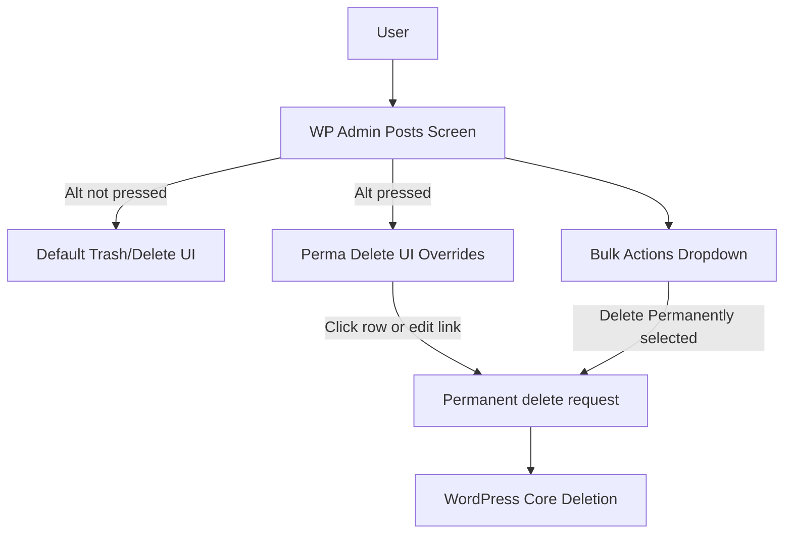

## wp-perma-delete Plugin Implementation Plan

### 1. Understand environment & plugin structure

- **Review plugin folder**: Inspect `[wp-perma-delete/index.php](wp-perma-delete/index.php)` and overall plugin directory to confirm headers, plugin activation hooks, and current enqueue logic (if any).
- **Confirm admin-only scope**: Ensure the plugin is intended to affect only the WordPress admin UI (post list table and post edit screen).

### 2. PHP: Core plugin bootstrap (`index.php`)

- **Add plugin header & i18n setup**: Ensure `index.php` has a standard WordPress plugin header and loads the plugin textdomain using `load_plugin_textdomain()` so strings are translatable.
- **Enqueue admin script**:
  - Hook into `admin_enqueue_scripts` to enqueue `wp-perma-delete.js` only on admin screens.
  - Restrict loading to post list (`edit.php`) and post edit (`post.php`, `post-new.php`) screens where trash is enabled.
  - Use `wp_enqueue_script()` with versioning (e.g. `filemtime`) and proper dependencies (e.g. `jquery`) and localize any needed data or translated strings via `wp_localize_script()`.
- **Ensure coding standards**: Write all PHP following WordPress coding standards (spacing, naming, escaping, hooks placement) and run it through a PHPCS WordPress ruleset if available.

### 3. JavaScript: Admin behavior (`wp-perma-delete.js`)

- **General approach**: Implement behavior using vanilla JS or jQuery (consistent with WordPress admin), ensuring it runs after the admin DOM is ready and works across browsers on Windows, macOS, and Linux.
- **Alt-hover link in post table**:
  - Target post row action links in the posts table (`.row-actions` within `#the-list`).
  - Detect the existing "Trash" and "Delete Permanently" links for each row.
  - On `mouseover`/`focus` when the Alt key is pressed (or on `keydown`/`keyup` for Alt), temporarily swap the visible label or href so that the "Trash" action is replaced with a visible "Delete Permanently" when Alt is held, reverting when Alt is released.
  - Ensure behavior updates correctly when using quick/bulk actions or after inline edits (listen for `ajaxComplete` to rebind if needed).
- **Alt-hover link on post edit screen**:
  - On single post edit pages, locate the trash/delete controls (e.g. the "Move to Trash" link near the publish meta box).
  - Apply similar Alt-key behavior so that holding Alt changes the control to a permanent delete action (updating text and target URL appropriately), restoring when Alt is released.
- **Bulk actions always include Delete Permanently**:
  - Identify the bulk actions dropdowns (`select[name='action']`, `select[name='action2']`) on post list screens.
  - Ensure an option for "Delete Permanently" (properly translated) is always present, even when trash is enabled.
  - If WordPress core already adds it, avoid duplicates by checking for an existing option value.
- **Accessibility & UX**:
  - Ensure that the Alt-key behavior is discoverable via title/tooltip or screen-reader-friendly text if possible (using localized strings from PHP).
  - Avoid breaking default behavior when Alt is not pressed.

### 4. Internationalization (i18n)

- **Translatable strings**:
  - Wrap all user-facing strings in PHP using `__()`, `_e()`, or related functions with a consistent textdomain (e.g. `wp-perma-delete`).
  - If strings are used in JS, pass them via `wp_localize_script()` so translations are respected.
- **Textdomain alignment**:
  - Match the textdomain to the plugin slug and ensure future `.pot` generation will pick up all strings.

### 5. Testing & compatibility

- **Admin behavior tests**:
  - Test post list table and post edit screens for multiple post types where trash is enabled.
  - Verify Alt-key behavior for both mouse and keyboard interaction (tabbing to links).
  - Confirm bulk actions always include "Delete Permanently" and that actions perform as expected.
- **Cross-platform & browser checks**:
  - Sanity-check Alt-key detection in at least Chrome and Firefox on macOS; ensure implementation does not rely on platform-specific keycodes.
- **Non-intrusiveness**:
  - Confirm that when the plugin is disabled, the admin UI returns to default behavior and no JS errors persist.

### 6. Documentation

- **Update README**:
  - Add a short section describing the plugin behavior, key features (Alt-based delete, bulk action enhancement), and any caveats.
  - Note that the plugin follows WordPress coding standards and supports translations.

### 7. High-level interaction flow (for reference)

